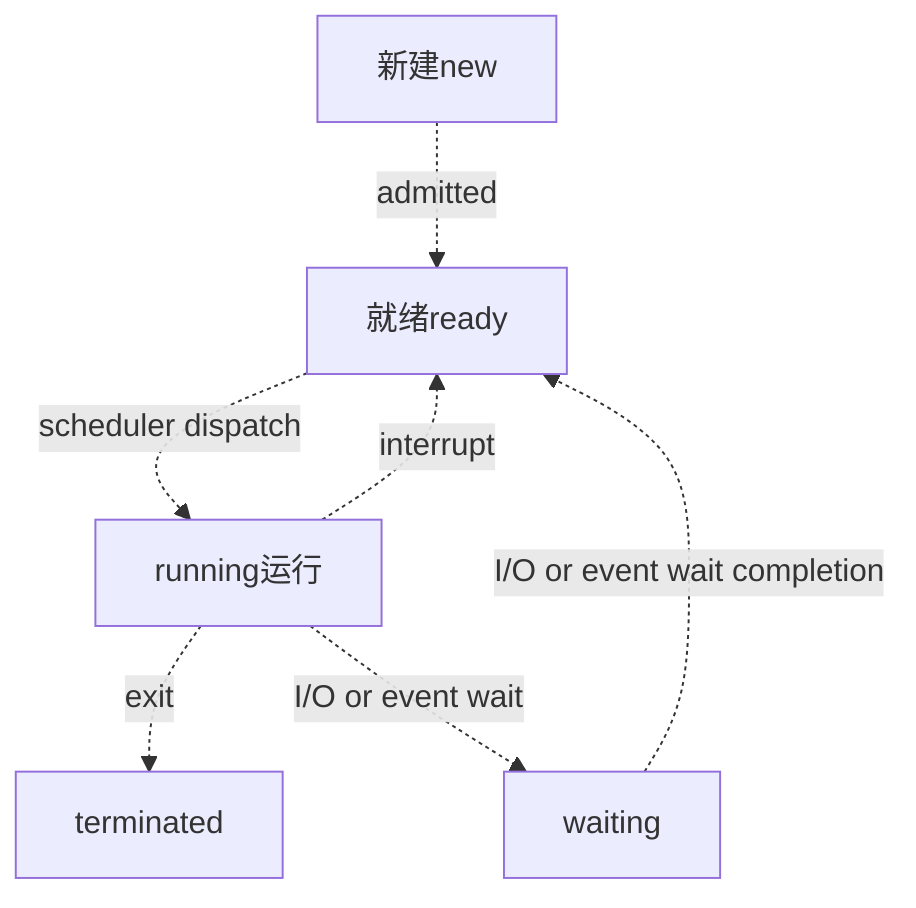

# notebook OS

记笔记还行, 做大文件应该要重开一个仓库.

mit的操作系统课

[6.S081 / Fall 2020 (mit.edu)](https://pdos.csail.mit.edu/6.828/2020/tools.html)


## 内存管理

简单分为**连续分配管理方式**和**非连续分配管理方式**这两种。连续分配管理方式是指为一个用户程序分配一个连续的内存空间，常见的如 **块式管理** 。同样地，非连续分配管理方式允许一个程序使用的内存分布在离散或者说不相邻的内存中，常见的如**页式管理** 和 **段式管理**。

1. **块式管理** ： 远古时代的计算机操系统的内存管理方式。将内存分为几个固定大小的块，每个块中只包含一个进程。如果程序运行需要内存的话，操作系统就分配给它一块，如果程序运行只需要很小的空间的话，分配的这块内存很大一部分几乎被浪费了。这些在每个块中未被利用的空间，我们称之为碎片。
2. **页式管理** ：把主存分为大小相等且固定的一页一页的形式，页较小，相对相比于块式管理的划分力度更大，提高了内存利用率，减少了碎片。页式管理通过页表对应逻辑地址和物理地址。
3. **段式管理** ： 页式管理虽然提高了内存利用率，但是页式管理其中的页并无任何实际意义。 段式管理把主存分为一段段的，每一段的空间又要比一页的空间小很多 。但是，最重要的是段是有实际意义的，每个段定义了一组逻辑信息，例如,有主程序段 MAIN、子程序段 X、数据段 D 及栈段 S 等。 段式管理通过段表对应逻辑地址和物理地址。

 **段页式管理机制** 。段页式管理机制结合了段式管理和页式管理的优点。简单来说段页式管理机制就是把主存先分成若干段，每个段又分成若干页，也就是说 **段页式管理机制** 中段与段之间以及段的内部的都是离散的。

### 页表管理机制 

页表管理机制中有两个很重要的概念：快表和多级页表，这两个东西分别解决了页表管理中很重要的两个问题。你给我简单介绍一下吧！

在分页内存管理中，很重要的两点是：

1. 虚拟地址到物理地址的转换要快。
2. 解决虚拟地址空间大，页表也会很大的问题。

#### 快表 translation lookaside bufferTLB

 Linux 通过 TLB（Translation Lookaside Buffer）来管理虚拟内存到物理内存的映射关系。当虚拟内存更新后，TLB 也需要刷新，内存的访问也会随之变慢。特别是在多处理器系统上，缓存是被多个处理器共享的，刷新缓存不仅会影响当前处理器的进程，还会影响共享缓存的其他处理器的进程。

为了解决虚拟地址到物理地址的转换速度，操作系统在 **页表方案** 基础之上引入了 **快表** 来加速虚拟地址到物理地址的转换。我们可以把快表理解为一种特殊的高速缓冲存储器（Cache），其中的内容是页表的一部分或者全部内容。作为页表的 Cache，它的作用与页表相似，但是提高了访问速率。由于采用页表做地址转换，读写内存数据时 CPU 要访问两次主存。有了快表，有时只要访问一次高速缓冲存储器，一次主存，这样可加速查找并提高指令执行速度。

使用快表之后的地址转换流程是这样的：

1. 根据虚拟地址中的页号查快表；
2. 如果该页在快表中，直接从快表中读取相应的物理地址；
3. 如果该页不在快表中，就访问内存中的页表，再从页表中得到物理地址，同时将页表中的该映射表项添加到快表中；
4. 当快表填满后，又要登记新页时，就按照一定的淘汰策略淘汰掉快表中的一个页。

看完了之后你会发现快表和我们平时经常在我们开发的系统使用的缓存（比如 Redis）很像，的确是这样的，操作系统中的很多思想、很多经典的算法，你都可以在我们日常开发使用的各种工具或者框架中找到它们的影子。

#### 多级页表

多级页表可以压缩页表占用的内存

我们反过来想，每个进程都有4GB的虚拟地址空间，而显然对于大多数程序来说，其使用到的空间远未达到4GB，何必去映射不可能用到的空间呢？

也就是说，一级页表覆盖了整个4GB虚拟地址空间，但如果某个一级页表的页表项没有被用到，也就不需要创建这个页表项对应的二级页表了，即可以在需要时才创建二级页表。做个简单的计算，假设只有20%的一级页表项被用到了，那么页表占用的内存空间就只有0.804MB（`1K * 4B + 0.2 * 1K * 1K * 4B = 0.804MB`），对比单级页表的4M是不是一个巨大的节约？

那么为什么不分级的页表就做不到这样节约内存呢？我们从页表的性质来看，保存在主存中的页表承担的职责是将虚拟地址翻译成物理地址；假如虚拟地址在页表中找不到对应的页表项，计算机系统就不能工作了。所以页表一定要覆盖全部虚拟地址空间，不分级的页表就需要有1M个页表项来映射，而二级页表则最少只需要1K个页表项（此时一级页表覆盖到了全部虚拟地址空间，二级页表在需要时创建）。


### 缺页故障

操作系统创建进程时会在disk上全部创建空间, 叫做swap区, 为进程的全部虚拟地址空间预留的磁盘空间. 缺页时,就需要调度.

#### 页调度算法

LRU , 选择近期内不会用到的页进行替换, 最小化缺页的次数, LRU , 最近最少使用策略,查找last recent used page , 从主存先放到swap 区, 然后把disk中需要的page找到. 一般不会完全准确LRU, 有的硬件可能用一个引用位或叫使用位来估算.

 LFU .

### 传统管理

传统存储管理还有以下几个特征：

1.**一次性：作业必须一次性全部装入内存后才能开始运行**。这会造成两个问题：

  （1）作业很大时，不能全部装入内存，导致**大作业无法运行**：(比如大型的游戏)

  （2）当大量作业要求运行时，由于内存无法容纳所有作业，因此只有少量作业能运行，导致**多道程序并发度下降**。

2.**驻留性**：一旦作业被装入内存，就**会一直驻留在内存**中，直至作业运行结束。**事实上，在一个时间段内，只需访问作业的一小部分数据即可正常运行**，这就导致了内存中会驻留大量的、暂时用不到的数据，浪费了宝贵的内存资源。

**局部性原理**：

**时间局部性**：如果执行了程序中的某条指令，那么不久后这条指令很有可能再次被执行；如果某个数据被访问过，不就之后该数据很有可能再次被访问。（因为**程序中存在大量的循环**）

**空间局部性**：一旦程序访问了某个存户单元，在不久之后，其附近的存储单元也很有可能被访问。（因为**很多数据在内存中都是连续存放的**）。

## 虚拟存储技术

通过使用存储设备扩展存储空间来提供大而便宜的存储空间。


它应用上下文切换来在内存和存储设备之间异步交换页面.以在发生页面错误时隐藏存储设备的较长响应时间。但是，整体上下文切换开销很高，因为上下文切换本身是一个复杂的功能，并且在上下文切换之后还会进一步导致TLB击落/刷新和强制性CPU高速缓存未命中。相反，随着高端存储设备响应速度的快速提高，我们观察到高端存储设备的响应时间会赶上并逐渐变得小于整体上下文切换开销。在这个转折点上，为了进一步增强系统响应能力，我们提倡采用同步交换而不是上下文切换来响应页面错误。

## 上下文切换

根据任务的不同，可以分为以下三种类型 

进程上下文切换(也叫CPU调度) , 线程上下文切换 ,中断上下文切换

首先，**进程是由内核来管理和调度的，进程的切换只能发生在内核态**。所以，进程的上下文不仅包括了虚拟内存、栈、全局变量等用户空间的资源，还包括了内核堆栈、寄存器等内核空间的状态。

因此，**进程的上下文切换就比系统调用时多了一步：在保存内核态资源（当前进程的内核状态和 CPU 寄存器）之前，需要先把该进程的用户态资源（虚拟内存、栈等）保存下来；而加载了下一进程的内核态后，还需要刷新进程的虚拟内存和用户栈**。

线程与进程最大的区别在于：**线程是调度的基本单位，而进程则是资源拥有的基本单位**。说白了，所谓内核中的任务调度，实际上的调度对象是线程；而进程只是给线程提供了虚拟内存、全局变量等资源。

所以，对于线程和进程，我们可以这么理解： 

- 当进程只有一个线程时，可以认为进程就等于线程。 

- 当进程拥有多个线程时，这些线程会共享相同的虚拟内存和全局变量等资源。这些资源在上下文切换时是不需要修改的。 

- 另外，线程也有自己的私有数据，比如栈和寄存器等，这些在上下文切换时也是需要保存的。

### 发生线程上下文切换的场景

1. 前后两个线程属于不同进程。此时，因为资源不共享，所以切换过程就跟进程上下文切换是一样。
2. 前后两个线程属于同一个进程。此时，因为虚拟内存是共享的，所以在切换时，虚拟内存这些资源就保持不动，只需要切换线程的私有数据、寄存器等不共享的数据


### 击落/刷新


## 同步交换


## 缓冲区:

高速设备与低速设备的不匹配，势必会让高速设备花时间等待低速设备，我们可以在这两者之间设立一个缓冲区。

1.可以解除两者的制约关系，数据可以直接送往缓冲区，高速设备不用再等待低速设备，提高了计算机的效率。例如：我们使用打印机打印文档，由于打印机的打印速度相对较慢，我们先把文档输出到打印机相应的缓冲区，打印机再自行逐步打印，这时我们的CPU可以处理别的事情。

2.可以减少数据的读写次数，如果每次数据只传输一点数据，就需要传送很多次，这样会浪费很多时间，因为开始读写与终止读写所需要的时间很长，如果将数据送往缓冲区，待缓冲区满后再进行传送会大大减少读写次数，这样就可以节省很多时间。例如：我们想将数据写入到磁盘中，不是立马将数据写到磁盘中，而是先输入缓冲区中，当缓冲区满了以后，再将数据写入到磁盘中，这样就可以减少磁盘的读写次数，不然磁盘很容易坏掉。

**缓存（cache）与缓冲(buffer)的主要区别**

Buffer的核心作用是用来缓冲，缓和冲击。比如你每秒要写100次硬盘，对系统冲击很大，浪费了大量时间在忙着处理开始写和结束写这两件事嘛。用个buffer暂存起来，变成每10秒写一次硬盘，对系统的冲击就很小，写入效率高了，日子过得爽了。极大缓和了冲击。

Cache的核心作用是加快取用的速度。比如你一个很复杂的计算做完了，下次还要用结果，就把结果放手边一个好拿的地方存着，下次不用再算了。加快了数据取用的速度。

简单来说就是buffer偏重于写，而cache偏重于读。

为了面试, 


## 线程与进程

### 线程

我们知道系统调用`fork()`可以新建一个子进程，函数`pthread()`可以新建一个线程。**但无论线程还是进程，都是用`task_struct`结构表示的，唯一的区别就是共享的数据区域不同**。

换句话说，线程看起来跟进程没有区别，只是线程的某些数据区域和其父进程是共享的，而子进程是拷贝副本，而不是共享。就比如说，`mm`结构和`files`结构在线程中都是共享的.我们的多线程程序要利用锁机制，避免多个线程同时往同一区域写入数据，否则可能造成数据错乱。

只有 Linux 系统将线程看做共享数据的进程，不对其做特殊看待，其他的很多操作系统是对线程和进程区别对待的，线程有其特有的数据结构.

在 Linux 中新建线程和进程的效率都是很高的，对于新建进程时内存区域拷贝的问题，Linux 采用了 copy-on-write 的策略优化，也就是并不真正复制父进程的内存空间，而是等到需要写操作时才去复制。**所以 Linux 中新建进程和新建线程都是很迅速的**。

#### 线程同步

线程同步是两个或多个共享关键资源的线程的并发执行。应该同步线程以避免关键的资源使用冲突。操作系统一般有下面三种线程同步的方式：

1. **互斥量(Mutex)**：采用互斥对象机制，只有拥有互斥对象的线程才有访问公共资源的权限。因为互斥对象只有一个，所以可以保证公共资源不会被多个线程同时访问。比如 Java 中的 synchronized 关键词和各种 Lock 都是这种机制。
2. **信号量(Semphares)** ：它允许同一时刻多个线程访问同一资源，但是需要控制同一时刻访问此资源的最大线程数量
3. **事件(Event)** :Wait/Notify：通过通知操作的方式来保持多线程同步，还可以方便的实现多线程优先级的比较操

### 进程

进程是要依靠操作系统创建的，每个进程都有它的固有属性，比如进程号（PID）、进程状态、打开的文件等等，进程创建好之后，读入你的程序，你的程序才被系统执行。

**对于操作系统，进程就是一个数据结构**，

```text
struct task_struct {
    // 进程状态
    long              state;
    // 虚拟内存结构体
    struct mm_struct  *mm;
    // 进程号
    pid_t             pid;
    // 指向父进程的指针
    struct task_struct __rcu  *parent;
    // 子进程列表
    struct list_head        children;
    // 存放文件系统信息的指针
    struct fs_struct        *fs;
    // 一个数组，包含该进程打开的文件指针
    struct files_struct     *files;
};
```

`task_struct`就是 Linux 内核对于一个进程的描述，也可以称为「进程描述符」。

比较有意思的是`mm`指针和`files`指针。`mm`指向的是进程的虚拟内存，也就是载入资源和可执行文件的地方；`files`指针指向一个数组，这个数组里装着所有该进程打开的文件的指针。



### 进程的调度算法

为了确定首先执行哪个进程以及最后执行哪个进程以实现最大 CPU 利用率，计算机科学家已经定义了一些算法，它们是：

- **先到先服务(FCFS)调度算法** : 从就绪队列中选择一个最先进入该队列的进程为之分配资源，使它立即执行并一直执行到完成或发生某事件而被阻塞放弃占用 CPU 时再重新调度。

- **短作业优先(SJF)的调度算法** : 从就绪队列中选出一个估计运行时间最短的进程为之分配资源，使它立即执行并一直执行到完成或发生某事件而被阻塞放弃占用 CPU 时再重新调度。

- **时间片轮转调度算法** : 时间片轮转调度是一种最古老，最简单，最公平且使用最广的算法，又称 RR(Round robin)调度。每个进程被分配一个时间段，称作它的时间片，即该进程允许运行的时间。

- **多级反馈队列调度算法** ：前面介绍的几种进程调度的算法都有一定的局限性。如**短进程优先的调度算法，仅照顾了短进程而忽略了长进程** 。多级反馈队列调度算法既能使高优先级的作业得到响应又能使短作业（进程）迅速完成。，因而它是目前**被公认的一种较好的进程调度算法**，UNIX 操作系统采取的便是这种调度算法

  这个算法 允许进程在队列之间迁移。这种想法是，根据不同**CPU**执行的特点来区分进程。如果进程使用过多的**CPU**时间，那么它会被移到更低的优先级队列。这种方案将**I/O**密集型和交互进程放在更高优先级队列上。 此外，在较低优先级队列中等待过长的进程会被移到更高优先级队列。这种形式的优化可阻止starving的发生。

- **优先级调度** ： 为每个流程分配优先级，首先执行具有最高优先级的进程，依此类推。具有相同优先级的进程以 FCFS 方式执行。可以根据内存要求，时间要求或任何其他资源要求来确定优先级。


### 进程间通讯 inter process communication

每个进程有不同的用户地址空间, 任何一个进程的全局变量在另一个进程中都看不到, 所以必须通过内核, 内核开辟缓冲区, 来通信

7种方式

第一类: 传统的unix 通信机制

#### 1.管道 ,匿名管道 pipe  

管道是半双工的, 数据只能向一个方向流动；需要双方通信时，需要建立起两个管道。

只能用于父子进程或者兄弟进程之间(具有亲缘关系的进程);

单独构成一种独立的文件系统：管道对于管道两端的进程而言，就是一个文件，但它不是普通的文件，它不属于某种文件系统，而是自立门户，单独构成一种文件系统，并且只存在于内存中。

数据的读出和写入：一个进程向管道中写的内容被管道另一端的进程读出。写入的内容每次都添加在管道缓冲区的末尾，并且每次都是从缓冲区的头部读出数据。

**管道的实质：**

管道的实质是一个内核缓冲区，进程以先进先出的方式从缓冲区存取数据，管道一端的进程顺序的将数据写入缓冲区，另一端的进程则顺序的读出数据。
 该缓冲区可以看做是一个循环队列，读和写的位置都是自动增长的，不能随意改变，一个数据只能被读一次，读出来以后在缓冲区就不复存在了。
 当缓冲区读空或者写满时，有一定的规则控制相应的读进程或者写进程进入等待队列，当空的缓冲区有新数据写入或者满的缓冲区有数据读出来时，就唤醒等待队列中的进程继续读写。

**管道的局限：**
 管道的主要局限性正体现在它的特点上：

- 只支持单向数据流；
- 只能用于具有亲缘关系的进程之间；
- 没有名字；
- 管道的缓冲区是有限的（管道制存在于内存中，在管道创建时，为缓冲区分配一个页面大小）；
- 管道所传送的是无格式字节流，这就要求管道的读出方和写入方必须事先约定好数据的格式，比如多少字节算作一个消息（或命令、或记录）等等；

#### **2. 有名管道(FIFO)**

 匿名管道，由于没有名字，只能用于亲缘关系的进程间通信。为了克服这个缺点，提出了有名管道(FIFO)。
 有名管道不同于匿名管道之处在于它提供了一个路径名与之关联，**以有名管道的文件形式存在于文件系统中**，这样，**即使与有名管道的创建进程不存在亲缘关系的进程，只要可以访问该路径，就能够彼此通过有名管道相互通信**，因此，通过有名管道不相关的进程也能交换数据。值的注意的是，有名管道严格遵循**先进先出(first in first out)**,对匿名管道及有名管道的读总是从开始处返回数据，对它们的写则把数据添加到末尾。它们不支持诸如lseek()等文件定位操作。**有名管道的名字存在于文件系统中，内容存放在内存中。**

#### **3. 信号(Signal)**

- 信号是Linux系统中用于进程间互相通信或者操作的一种机制，信号可以在任何时候发给某一进程，而无需知道该进程的状态。
- 如果该进程当前并未处于执行状态，则该信号就被内核保存起来，直到该进程回复执行并传递给它为止。
- 如果一个信号被进程设置为阻塞，则该信号的传递被延迟，直到其阻塞被取消才被传递给进程。

**Linux系统中常用信号：**
 （1）**SIGHUP：**用户从终端注销，所有已启动进程都将收到该进程。系统缺省状态下对该信号的处理是终止进程。
 （2）**SIGINT：**程序终止信号。程序运行过程中，按`Ctrl+C`键将产生该信号。
 （3）**SIGQUIT：**程序退出信号。程序运行过程中，按`Ctrl+\\`键将产生该信号。
 （4）**SIGBUS和SIGSEGV：**进程访问非法地址。
 （5）**SIGFPE：**运算中出现致命错误，如除零操作、数据溢出等。
 （6）**SIGKILL：**用户终止进程执行信号。shell下执行`kill -9`发送该信号。
 （7）**SIGTERM：**结束进程信号。shell下执行`kill 进程pid`发送该信号。
 （8）**SIGALRM：**定时器信号。
 （9）**SIGCLD：**子进程退出信号。如果其父进程没有忽略该信号也没有处理该信号，则子进程退出后将形成僵尸进程。

**信号来源**
 信号是软件层次上对中断机制的一种模拟，是一种异步通信方式,信号可以在用户空间进程和内核之间直接交互，内核可以利用信号来通知用户空间的进程发生了哪些系统事件，信号事件主要有两个来源：

- 硬件来源：用户按键输入`Ctrl+C`退出、硬件异常如无效的存储访问等。
- 软件终止：终止进程信号、其他进程调用kill函数、软件异常产生信号。

**信号生命周期和处理流程**
 （1）信号被某个进程产生，并设置此信号传递的对象（一般为对应进程的pid），然后传递给操作系统；
 （2）操作系统根据接收进程的设置（是否阻塞）而选择性的发送给接收者，如果接收者阻塞该信号（且该信号是可以阻塞的），操作系统将暂时保留该信号，而不传递，直到该进程解除了对此信号的阻塞（如果对应进程已经退出，则丢弃此信号），如果对应进程没有阻塞，操作系统将传递此信号。
 （3）目的进程接收到此信号后，将根据当前进程对此信号设置的预处理方式，暂时终止当前代码的执行，保护上下文（主要包括临时寄存器数据，当前程序位置以及当前CPU的状态）、转而执行中断服务程序，执行完成后回复到中断的位置。当然，对于抢占式内核，在中断返回时还将引发新的调度。


#### **4. 消息(Message)队列**

- 消息队列是存放在内核中的消息链表，每个消息队列由消息队列标识符表示。
- 与管道（无名管道：只存在于内存中的文件；命名管道：存在于实际的磁盘介质或者文件系统）不同的是消息队列存放在内核中，只有在内核重启(即，操作系统重启)或者删除一个消息队列时，该消息队列才会被真正的删除。
- 另外与管道不同的是，消息队列在某个进程往一个队列写入消息之前，并不需要另外某个进程在该队列上等待消息的到达。

**消息队列特点总结：**
 （1）消息队列是消息的链表,具有特定的格式,存放在内存中并由消息队列标识符标识.
 （2）消息队列允许一个或多个进程向它写入与读取消息.
 （3）管道和消息队列的通信数据都是先进先出的原则。
 （4）消息队列可以实现消息的随机查询,消息不一定要以先进先出的次序读取,也可以按消息的类型读取.比FIFO更有优势。
 （5）消息队列克服了信号承载信息量少，管道只能承载无格式字 节流以及缓冲区大小受限等缺。
 （6）目前主要有两种类型的消息队列：POSIX消息队列以及System V消息队列，消息队列目前被大量使用。系统消息队列是随内核持续的，只有在内核重启或者人工删除时，该消息队列才会被删除。

#### **5. 共享内存(share memory)**

- 使得多个进程可以可以直接读写同一块内存空间，是最快的可用IPC形式。是针对其他通信机制运行效率较低而设计的。
- 为了在多个进程间交换信息，内核专门留出了一块内存区，可以由需要访问的进程将其映射到自己的私有地址空间。进程就可以直接读写这一块内存而不需要进行数据的拷贝，从而大大提高效率。
- 由于多个进程共享一段内存，因此需要依靠某种同步机制（如信号量）来达到进程间的同步及互斥。

#### **6. 信号量(semaphore)**

 信号量是一个计数器，用于多进程对共享数据的访问，信号量的意图在于进程间同步。
 为了获得共享资源，进程需要执行下列操作：
 （1）**创建一个信号量**：这要求调用者指定初始值，对于二值信号量来说，它通常是1，也可是0。
 （2）**等待一个信号量**：该操作会测试这个信号量的值，如果小于0，就阻塞。也称为P操作。
 （3）**挂出一个信号量**：该操作将信号量的值加1，也称为V操作。

为了正确地实现信号量，信号量值的测试及减1操作应当是原子操作。为此，信号量通常是在内核中实现的。Linux环境中，有三种类型：**Posix（[可移植性操作系统接口](https://link.jianshu.com?t=http://baike.baidu.com/link?url=hYEo6ngm9MlqsQHT3h28baIDxEooeSPX6wr_FdGF-F8mf7wDp2xJWIDtQWGEDxthtPNiJtlsw460g1_N0txJYa)）有名信号量（使用Posix IPC名字标识）**、**Posix基于内存的信号量（存放在共享内存区中）**、**System V信号量（在内核中维护）**。这三种信号量都可用于进程间或线程间的同步。

#### **7. 套接字(socket)**

 套接字是一种通信机制，凭借这种机制，客户/服务器（即要进行通信的进程）系统的开发工作既可以在本地单机上进行，也可以跨网络进行。也就是说它可以让不在同一台计算机但通过网络连接计算机上的进程进行通信

套接字是支持TCP/IP的网络通信的基本操作单元，可以看做是不同主机之间的进程进行双向通信的端点，简单的说就是通信的两方的一种约定，用套接字中的相关函数来完成通信过程。

**套接字特性**
 套接字的特性由3个属性确定，它们分别是：域、端口号、协议类型。
 **（1）套接字的域**
 它指定套接字通信中使用的网络介质，最常见的套接字域有两种：
 **一是AF_INET，它指的是Internet网络。**当客户使用套接字进行跨网络的连接时，它就需要用到服务器计算机的IP地址和端口来指定一台联网机器上的某个特定服务，所以在使用socket作为通信的终点，服务器应用程序必须在开始通信之前绑定一个端口，服务器在指定的端口等待客户的连接。
 **另一个域AF_UNIX，表示UNIX文件系统，**它就是文件输入/输出，而它的地址就是文件名。
 **（2）套接字的端口号**
 每一个基于TCP/IP网络通讯的程序(进程)都被赋予了唯一的端口和端口号，端口是一个信息缓冲区，用于保留Socket中的输入/输出信息，端口号是一个16位无符号整数，范围是0-65535，以区别主机上的每一个程序（端口号就像房屋中的房间号），低于256的端口号保留给标准应用程序，比如pop3的端口号就是110，每一个套接字都组合进了IP地址、端口，这样形成的整体就可以区别每一个套接字。
 **（3）套接字协议类型**
 因特网提供三种通信机制，
 **一是流套接字，**流套接字在域中通过TCP/IP连接实现，同时也是AF_UNIX中常用的套接字类型。流套接字提供的是一个有序、可靠、双向字节流的连接，因此发送的数据可以确保不会丢失、重复或乱序到达，而且它还有一定的出错后重新发送的机制。
 **二个是数据报套接字，**它不需要建立连接和维持一个连接，它们在域中通常是通过UDP/IP协议实现的。它对可以发送的数据的长度有限制，数据报作为一个单独的网络消息被传输,它可能会丢失、复制或错乱到达，UDP不是一个可靠的协议，但是它的速度比较高，因为它并一需要总是要建立和维持一个连接。
 **三是原始套接字，**原始套接字允许对较低层次的协议直接访问，比如IP、 ICMP协议，它常用于检验新的协议实现，或者访问现有服务中配置的新设备，因为RAW SOCKET可以自如地控制Windows下的多种协议，能够对网络底层的传输机制进行控制，所以可以应用原始套接字来操纵网络层和传输层应用。比如，我们可以通过RAW SOCKET来接收发向本机的ICMP、IGMP协议包，或者接收TCP/IP栈不能够处理的IP包，也可以用来发送一些自定包头或自定协议的IP包。网络监听技术很大程度上依赖于SOCKET_RAW。

原始套接字可以读写内核没有处理的IP数据包，而流套接字只能读取TCP协议的数据，数据报套接字只能读取UDP协议的数据。因此，如果要访问其他协议发送数据必须使用原始套接字。


### 文件描述符

先说`files`，它是一个文件指针数组。一般来说，一个进程会从`files[0]`读取输入，将输出写入`files[1]`，将错误信息写入`files[2]`。

举个例子，以我们的角度 C 语言的`printf`函数是向命令行打印字符，但是从进程的角度来看，就是向`files[1]`写入数据；同理，`scanf`函数就是进程试图从`files[0]`这个文件中读取数据。

**每个进程被创建时，`files`的前三位被填入默认值，分别指向标准输入流、标准输出流、标准错误流。我们常说的「文件描述符」就是指这个文件指针数组的索引**，所以程序的文件描述符默认情况下 0 是输入，1 是输出，2 是错误。

对于一般的计算机，输入流是键盘，输出流是显示器，错误流也是显示器，所以现在这个进程和内核连了三根线。因为硬件都是由内核管理的，我们的进程需要通过「系统调用」让内核进程访问硬件资源。

如果我们写的程序需要其他资源，比如打开一个文件进行读写，这也很简单，进行系统调用，让内核把文件打开，这个文件就会被放到`files`的第 4 个位置

明白了这个原理，**输入重定向**就很好理解了，程序想读取数据的时候就会去`files[0]`读取，所以我们只要把`files[0]`指向一个文件，那么程序就会从这个文件中读取数据，而不是从键盘：

```bash
$ command < file.txt
```

同理，**输出重定向**就是把`files[1]`指向一个文件，那么程序的输出就不会写入到显示器，而是写入到这个文件中：

```bash
$ command > file.txt
```

**管道符**其实也是异曲同工，把一个进程的输出流和另一个进程的输入流接起一条「管道」，数据就在其中传递，不得不说这种设计思想真的很优美：

```bash
$ cmd1 | cmd2 | cmd3
```


到这里，你可能也看出「Linux 中一切皆文件」设计思路的高明了，不管是设备、另一个进程、socket 套接字还是真正的文件，全部都可以读写，统一装进一个简单的`files`数组，进程通过简单的文件描述符访问相应资源，具体细节交于操作系统，有效解耦，优美高效。


参考资料: 

1. Linux 进程、线程、文件描述符的底层原理 - labuladong的文章 - 知乎 https://zhuanlan.zhihu.com/p/105086274
2. 


### 面试要求:

首先问了页调度算法中的LRU和LFU，然后给了些例子要求解释最近应该要调那个页，简单。
C++程序内存结构
.text: 存放源代码
.rodata: 存放常量
.data: 存放初始化了的全局变量和静态变量
.bss: 存放了未初始化的全局变量和静态变量
.heap: 存放使用malloc, realloc, free等函数控制的变量
.stack: 函数调用时使用栈来保存函数现场，局部变量也存放在栈中
进程间通信的方式：信号量、管道…
内存分页以及怎么处理内存碎片
First-fit，Worst-fit，Best-fit

