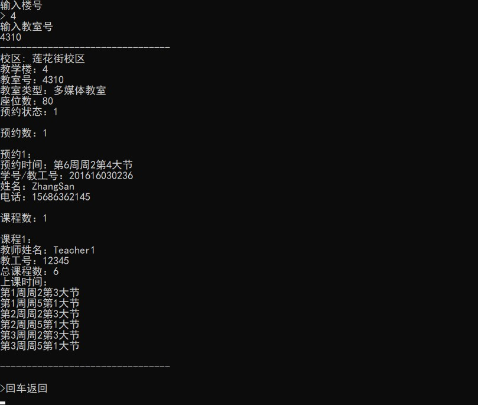
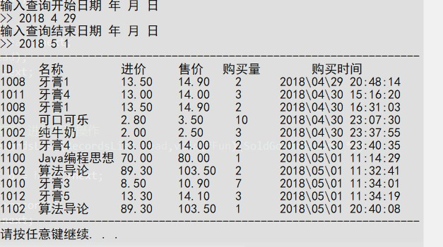
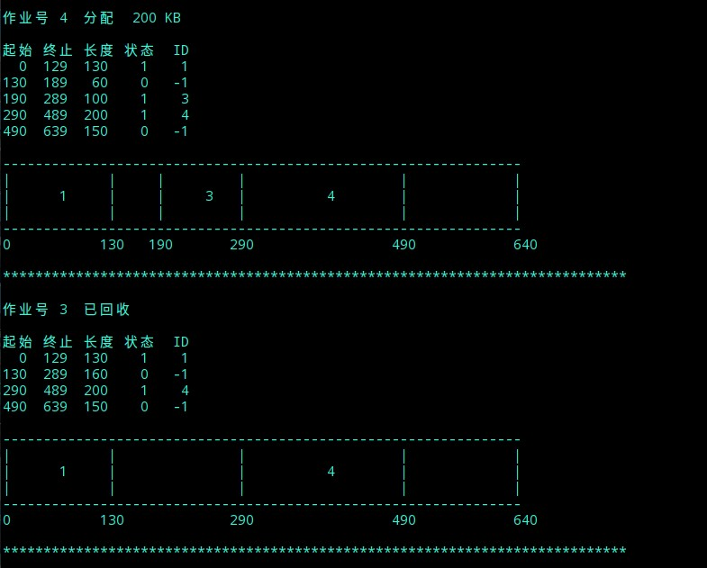
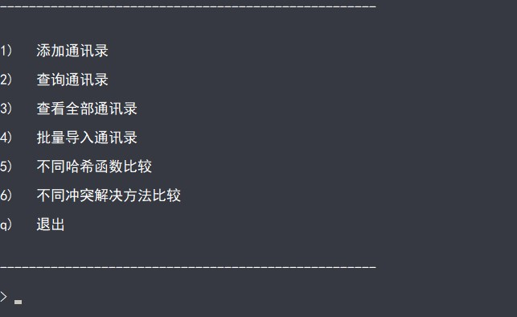
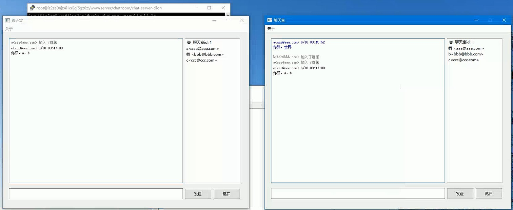

在此存放我在大学阶段所写的所有课程设计题目和代码

一部分是fork别人的,我大概就加入我的代码hhh.

先加入git笔记

- git笔记
- 

- OOP(C++)-面向对象程序设计：教室管理系统
- C-程序设计实践：小型超市库存与销售管理系统
- OS-操作系统课程设计：动态分区分配算法实现
- DataStructure-数据结构课程设计：基于哈希表的通讯录系统


#### git 笔记


使用git fecth方法将远程仓库项目更新到本地仓库用于开发

   ``` Bash
 git remote -v   
 git fetch origin master:temp
 git diff temp
 git merge temp
 git br -d temp
   ```

pull = fetch + merge ,多人协作时不够安全


<u>工作区搞错了之后</u>

先 git status 看一看.令`git checkout -- readme.txt`意思就是，把`readme.txt`文件在工作区的修改全部撤销，这里有两种情况：

一种是`readme.txt`自修改后还没有被放到暂存区，现在，撤销修改就回到和版本库一模一样的状态；

 

一种是`readme.txt`已经添加到暂存区后，又作了修改，现在，撤销修改就回到添加到暂存区后的状态。

总之，就是让这个文件回到最近一次`git commit`或`git add`时的状态。


<u>如果clone下来,直接push失败</u>

原因：
1.如果创建远程仓库的时候，没有勾选创建 README.md 的情况：暂存区还没有任何内容就向远程库进行提交，空的暂存区时不能提交上去的，需要至少有一次 add  和 commit
2.如果创建远程仓库的的时候，勾选了创建 README.md 的情况：github 中的 README.md 文件不在本地代码目录中

<u>branch不显示分支</u>

因为git的分支必须指向一个commit，没有commit就没有任何分支，提交一个commit后就会自动创建master分支


<u>fatal: HttpRequestException encountered.发送请求时出错</u>

可是在每次push  的时候，都要输入用户名和密码，很是麻烦

原因是使用了https方式 push

 fatal: Could not read from remote repository

用 git clone XX 命令从git上下拉代码时，也出现报这个错误，可是我明明ssh key已经配好了，为什么还会出现这样的事呢


Cpp笔记

####  map 笔记
  ``` C++
 map<const char, int> priority;//用map来储存运算符的优先级
 //第一个可以称为关键字，每个关键字只能在map中出现一次，第二个可能称为该关键字的值
  priority['#'] = -1; //反引号可以用来写代码块.
  priority[')'] = 0;
  priority['+'] = 1;
 priority['-'] = 1;
  priority['*'] = 2;
 priority['/'] = 2;
 priority['('] = 3;
  ```

- 

----------


#### OOP(C++)-面向对象课程设计

##### 题目
实现一个简单的教室管理系统，系统基本功能包括
1) 教室信息维护：教室编号、类型、座位数等基本信息的维护；
2) 查询功能：查询满足指定条件的教室信息；
3) 预约功能：根据查询结果对指定教室进行预约操作；
4) 统计功能：统计各类教室的情况。

##### 完成时间
大二上 2018/2

##### 运行截图



----------


#### 程序设计实践课程设计（转专业补修）

##### 题目

用C语言开发一个小型超市库存与销售管理系统。

【系统实现功能】

1、用户管理（操作用户数据文件）。

- 高级用户（超市管理者）：具有所有功能，同时可以添加用户、删除用户。创建新用户后，将普通用户信息存储到文件“user.dat”中。

- 普通用户（售货员）：可执行销售业务处理和查询功能。

2、进货&库存业务管理（操作库存数据文件）。根据商品编号查找相应商品，如果不存在，执行添加操作 ；如果商品已存在，根据进货数量修改商品数量。

3、销售业务处理（操作库存数据文件和销售数据文件）。用户在销售数据文件中添加销售记录，同时更新库存数据文件的相应商品的信息。

4、查询功能。支持以下几种查询方式：

- 按商品名称（精确查找，或模糊查找）查询商品基本信息（商品名、售价、库存）

- 按商品名称和生产厂商（多条件查询）查询商品基本信息（商品名、售价、库存）；

- 按销售日期查询某一天销售的情况。

5、功能扩展。可以按照自己对商品库存与销售系统的理解和解决问题的程度对系统进行扩展。比如：

- 支持商品批量入库（从文件中导入）。

- 按照固定的日期范围统计所销售的货物信息（商品名称，销售总量，收益率），像，月销售情况统计，季度销售情况统计，年度销售情况统计。

- 按照销售量、销售利润等条件，统计指定日期范围内商品的销售情况。

##### 完成时间
大二下 2018/4

##### 运行截图


----------


#### 操作系统课程设计

##### 题目
用C语言实现动态分区分配过程alloc()和回收过程free()。其中，空闲分区通过空闲分区链表来管理，分别采用首次适应算法、循环首次适应算法、最佳适应算法、最坏适应算法进行内存块的分配和回收，同时显示内存块分配和回收后空闲内存分区链的情况。
##### 完成时间
大二下 2018/6/25至2018/6/29

##### 运行截图



----------

#### 数据结构课程设计（转专业补修）

##### 题目
综合应用所学知识，设计完成一个散列表实现的电话号码查找系统。本系统拟实现以下功能：

【基本要求】

1. 设每个记录有下列数据项：电话号码、用户名、地址；
2. 从键盘输入各记录，分别以电话号码和用户名为关键字建立散列表；
3. 采用一定的方法解决冲突；
4. 查找并显示给定电话号码的记录；
5. 查找并显示给定用户名的记录。

【进一步完成内容】

1. 系统功能的完善；
2. 设计不同的散列函数，比较冲突率；
3. 在散列函数确定的前提下，尝试各种不同类型处理冲突的方法，考察平均查找长度的变化。

##### 完成时间
大三上 2018/12/24至2019/1/4

##### 运行截图



----------
#### 软件体系结构课程设计

##### 系统功能
本程序为基于 C/S 的网络聊天室系统，使用 Linux 网络编程作为服务器，使用 QT
编程作为客户端。

客户端通过输入 IP 地址、端口号、Email、聊天名称、聊天组号连接到服务器，
用户通过客户端发送消息，同时接收来自相同组其他客户端发送的消息，获取当前在
线用户信息，通知新用户的上线和用户的下线，实现群聊功能。

服务器负责管理用户的连接、发送消息与退出，有新用户建立连接时，记录新用
户信息，并向同组其他客户端广播；用户退出时，清除用户信息，并向同组其他客户
端广播离开信息；当有用户发送消息时，向同组其他客户端广播。

##### 完成时间
大三下 2019/5至2019/6

##### 运行截图



下面分享一下经验（**我先申明一下，以下所有内容都以功利性找工作为目标，就是让面试官觉得你屌，而不是让你真的变屌的思路，如果是已经工作的，可以不用看了**）： 重要性排序：**优先级递减** 第一档次:leetcode，数据库，语言基础，项目，jvm 第二档次：计算机网络，操作系统 学到这里找个中厂的实习应该没问题了 第三档次：各种框架，中间件，缓存，分布式知识等 

**1.学习顺序** 可以照着这个网课学，把SSM三大框架，还有springboot部分学完就行，如果每天从早学到晚脱产学习，从0基础到SpringBoot大概需要3~4个月 把这个网课学完以后，基本也就有了crud（搬砖）的能力，接下来的学习内容主要以应付面试为主

**2.leetcode** 我春招的时候（截止到今年4月中）大概做了200LC，拿了阿里腾讯美团百度的offer，字节投了5月份才联系我面试。。。就放弃了 秋招的时候（截止到今年9月中）大概做了350道LC，基本上手撕代码就没什么问题了。算法题是目前校招最重要的考察环节，连阿里都要手撕代码了，别的基础题你不会的话，你可以说一下子忘了，或者扯点相关的知识点，算法题不会就是不会，而且笔试是实打实的成绩。得重视一下。 **另外leetcode上的《剑指offer模块》和热门100题重点做** **3.数据库** 上面的网课学完了以后，工作中用到数据库基本的语法也就会了，我建议深入学习一下mysql进阶的知识，建议把数据库隔离级别、索引数据结构、为什么选B+树、各种索引失效情况、最左匹配原则，如何保证事务、MVCC原理与实现、Innodb和MyISAM的区别、如何对sql调优、聚集索引和非聚集索引、mysql有哪几种锁，如何解决幻读、三大范式等高频知识点做一个整理。也可以看看《高性能Mysql》 还有就是面试的时候可能会让你手撕sql，可以去leetcode上练几道 **4.语言基础** 我上面给的链接是java的，如果想学c++可以自己找找，如果学java的话，可以看我上面那个视频资料 **5.项目** 说出来你可能不信，我就是做了秒杀


虽然烂大街，但是好用。每次都能跟面试官扯好久,成功拖延面试时间。 当然我这是对于跨专业，且没有办法去实习的同学的建议，如果你本身是科班的，或者可以找个中厂的实习，其实企业的项目会好很多。或者也可以参加一些比赛（比如阿里的中间件比赛）。反正比赛项目或者实习项目，肯定比秒杀要好的

前提是你有这个时间去折腾，我因为只有1年时间所以来不及去折腾，只能搞了个秒杀 网上的秒杀系统项目很多，基本都大同小异，随便找一个做一下就行 B站上就有很多，举个例子 https://www.bilibili.com/video/BV1CJ411i7t8?from=search&seid=71672713836252527 如果是DIY的项目一定要突出亮点，**比如分布式锁，一致性哈希，削峰降级，多级缓存、限流算法、分布式事务等**

**6.JVM&并发相关** jvm对于java的同学来说绝对是个高频的考点，《深入理解java虚拟机》一定要好好看 并发相关知识也要学习一下，比如juc相关类，线程池相关知识、Synchronized和Lock的区别、AQS等。我的建议是先去B站找视频里看看了解基本用法和原理，然后再点到源码里看看，就会理解的比较透彻。比如我就利用AQS自己写了一个并发工具类，从此面试的时候遇到AQS都成了加分项 我同学说下面两个视频不错 https://www.bilibili.com/video/BV1V4411p7EF https://www.bilibili.com/video/BV1B7411L7tE 

**7.计算机网络，操作系统** 这两门课我都是把考研教材快速的过了一遍，大概1周看完了,看了感觉跟没看一样，然后刷了一下面筋，发现问来问去都是那些八股文：三次握手、四次挥手、tcp和udp的区别、http协议，进程与线程的区别等,这一块的复习，我建议快速过一遍教材或者网课后直接刷面筋，然后背就完了，这两门课的知识点很多，但是问来问去的知识点就那些，抓住那些常考的深入学习就行了，不常考的就算被问到了，直接说忘了，如果你算法题能做出来，面试大概率还是能通过的

**8、中间件，缓存，分布式知识** B站找视频学，这些中间件，我的建议是，先会用，再深入，最好能仿写。B站上找些视频学，可以快速的学习到用法，然后再去找源码看看深入理解原理，最好能做个仿写。我在秋招之前自己仿写了Spring，Dubbo，RxJava的代码，自己模仿着写了一些小框架。可以作为面试的加分项

最好还是自己没事去牛客翻翻，然后自己整理一份面筋资料是最好的。

