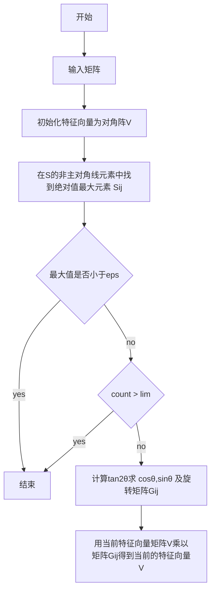

测试集

```matlab
[3 2 4]
[2 0 2]
[4 2 3]
```

按列存

[3 2 4 2 0 2 4 2 3]

按行存

3 2 4 2 0 2 4 2 3

3.0, 2.0, 4.0,2.0,0.0, 2.0,4.0 ,2.0 ,3.0// 这样是无法.exe执行的.

3 2 4 2 0 2 4 2.0 3.0 //可以的

特征值 λ1 = 8 , λ2 = λ3 = -1 

##### 样例2 :

```
2.0 -2.0 0.0 -2.0 1.0 -2.0 0 -2 0// 这是可以的

2.0 -2.0 0.0 -2.0 1.0 -2.0 0.00 -2 0.00//可以的

2.0 1.0 1.0 0.0 2.0 0.0  0.0 -1.0 1.0
2.0, -2.0, 0.0 ,-2.0, 1.0 ,-2.0, 0.00 ,-2.0 ,0.00
```

答案 EigenValues = 4.000000 1.000000 -2.000000

样例3 :

```
3

1.0 2.0   3.0 2.0 1.0   3 3 3 6.0
1.0 ,2.0,   3.0 ,2.0, 1.0 ,  3, 3, 3, 6.0

特征值为9,0,-1
```


样例4

7.0,2.0,1.0,8.0,5.0 ,0.0, 4.0,3.0,9.0


求逆测试集

```c

[ 1 0  1 ]
[1  1  2]
[3  4 2 ]
```

1 0 1 1 1 2  3 4 2


#### 一些问题

<u>怎么让他从cpp代码开始?</u>


<u>keil5可以 运行cpp代码吗?</u>

可以的,但是非常费cpu,大概能跑到25%. 别人都不会, 我build也特别慢,不知道为啥.


keil 5 编译器默认bai使用 C 编译，需要du调一下设置才能变成zhi默认C++编译。跟楼下一朋友说的dao一样，我试4102过了，可行。1、打开工1653程设置页面（上面一堆按钮中一个看起来像魔术棒的按钮）；2、选择 "C/C++" 选项卡，找到下面的 "Misc Controls"（下方倒数第二行）；3、加入 "--cpp11" （没有引号），如果这一栏有其他东西就在最后面加上 ",--cpp11"（去掉引号）；

或者

在include path下面的misc control里面添加--cpp11


#### ADS

ads 一次没装成功,后面就很麻烦, 我室友安装到100%卡住了,重装了4 5次, 安装路径不能有括号

一般默认(x86) ,但是ads是不能装在这里的


#### C与asm联调报错

报错1

Error: L6265E: Non-RWPI Section libspace.o(.bss) cannot be assigned to PI Exec region ER_ZI.
 Error: L6248E: libspace.o(.text) in PI region 'ER_RO' cannot have address type relocation to __libspace_start in PI region 'ER_ZI'.

解决:

配置

https://blog.csdn.net/weixin_42048417/article/details/80585993

就可以编译C和汇编了

报错2

Error: L6218E: Undefined symbol

.\try2.axf: Error: L6218E: Undefined symbol initEigVec (referred from testcmpeigval.o).

https://blog.csdn.net/zhizuwei/article/details/86017618

找到了官方文档

https://www.keil.com/support/man/docs/armerr/armerr_dom1365073159742.htm

报错3:

书143代码也报错, 到底应该放在c文件还是.asm文件?


https://www.cnblogs.com/Irvingcode/p/12111301.html

https://www.cnblogs.com/hoys/p/3571444.html

https://developer.aliyun.com/article/20918

试试这个.

报错4: L6411E: No compatible library exists with a definition of startup symbol __main

解决方法

1.系统变量名： ARMCC5LIB    

变量值：F:\Keil_v5\ARM\ARMCC\lib 

没有用

2.linker 改一下

--libpath=C:\Keil_v5\ARM\ARMCC\lib\armlib

也没有用

反正继续改, 把每个都改一改,  arm的设置也改一改, 最后就可以了.


报错5<u>“Error: Encountered an improper argument”的解决方法</u>

 在大多数情况下，亚洲使用Windows操作系统的客户在项目路径中使用亚洲字符时会受到此问题的影响。

请勿在项目的文件夹和文件名以及所有源文件和库中使用非ASCII字符。

此问题可能会在5.25以后的MDK版本中修复。

我在工程中的源文件中使用中文字符作为注释，看样子MDK对中文的支持还是不大好。以后还是尽量用英文做注释吧。

报错6:Data Abort: ARM Instruction at 00001540H, Memory Access at 417231C8H
使用情况**0xFFE0 8000** - 0xFFE0 BFFF 外部内存控制器 （EMC） （LPC2377/78，**仅 LPC2388**)

\>您使用的是 LPC2387。

**解决方法:  我的cpu不是2132 ,是2130 ,选择对应的debug CPU**


问题7:float用汇编处理

```
FLD类似于  PUSH指令
FSTP类似于 POP指令
FADD类似于 ADD指令
```


### 心得经验

每一次调试可以都应该commit 一下, 不然下次就不能调试了

调试汇编用一个简单的C调用, 小心对待大代码..

我用这个代码


sub #-1 是 加上1


```c
#include<stdio.h>
#include<math.h> 

using namespace std;

const int N=1005;
const double eps=1e-5;
const int lim=100;

int n,id[N];
double key[N],mat[N][N],EigVal[N],EigVec[N][N],tmpEigVec[N][N];

bool cmpEigVal(int x,int y)
{
return key[x]>key[y];
}

void Find_Eigen(int n,double (*a)[N],double *EigVal,double (*EigVec)[N])
{
for (int i=1;i<=n;i++)
for (int j=1;j<=n;j++)
EigVec[i][j]=0;
for (int i=1;i<=n;i++) EigVec[i][i]=1.0;
int count=0;
while (1)
	{
	//统计迭代次数 
	count++;
	//找绝对值最大的元素 
	double mx_val=0;
	int row_id,col_id;
	for (int i=1;i<n;i++)
	for (int j=i+1;j<=n;j++)
	if (fabs(a[i][j])>mx_val) mx_val=fabs(a[i][j]),row_id=i,col_id=j;
	if (mx_val<eps||count>lim) break;
	//进行旋转变换 
	int p=row_id,q=col_id;
	double Apq=a[p][q],App=a[p][p],Aqq=a[q][q];
	double theta=0.5*atan2(-2.0*Apq,Aqq-App);
	double sint=sin(theta),cost=cos(theta); 
	double sin2t=sin(2.0*theta),cos2t=cos(2.0*theta);
	a[p][p]=App*cost*cost+Aqq*sint*sint+2.0*Apq*cost*sint;
	a[q][q]=App*sint*sint+Aqq*cost*cost-2.0*Apq*cost*sint;
	a[p][q]=a[q][p]=0.5*(Aqq-App)*sin2t+Apq*cos2t;
	for (int i=1;i<=n;i++)
		if (i!=p&&i!=q)
		{
			double u=a[p][i],v=a[q][i];
			a[p][i]=u*cost+v*sint;a[q][i]=v*cost-u*sint;
			u=a[i][p],v=a[i][q];
			a[i][p]=u*cost+v*sint;a[i][q]=v*cost-u*sint;
		}
	//计算特征向量 
		for (int i=1;i<=n;i++)
		{
		double u=EigVec[i][p],v=EigVec[i][q];
		EigVec[i][p]=u*cost+v*sint;EigVec[i][q]=v*cost-u*sint;
		}
	}
//对特征值排序 
for (int i=1;i<=n;i++) id[i]=i,key[i]=a[i][i];
//std::sort(id+1,id+n+1,cmpEigVal); //#include<algorithm> lib 中 
for (int i=1;i<=n;i++)
	{
	EigVal[i]=a[id[i]][id[i]];
	for (int j=1;j<=n;j++)
		tmpEigVec[j][i]=EigVec[j][id[i]];
	}
for (int i=1;i<=n;i++)
	for (int j=1;j<=n;j++)
	EigVec[i][j]=tmpEigVec[i][j];
	//特征向量为列向量 
	}

int main()
{
	scanf("%d",&n);
	for (int i=1;i<=n;i++)
	for (int j=1;j<=n;j++)
	scanf("%lf",&mat[i][j]);
	Find_Eigen(n,mat,EigVal,EigVec);
	printf("EigenValues = ");
	for (int i=1;i<=n;i++) printf("%lf ",EigVal[i]);
	printf("\nEigenVector =\n");
	for (int i=1;i<=n;i++)
	for (int j=1;j<=n;j++)
	printf("%lf%c",EigVec[i][j],j==n?'\n':' ');
	return 0;
}
```

#### 2.C程序调用汇编程序

C程序调用汇编程序首先通过extern声明要调用的汇编程序模块，声明中形参个数要与汇编程序模块中需要的变量个数一致，且参数传递要满足ATPCS规则，然后在C程序中调用。

例子：

\#include<stdio.h>

extern void *strcopy(char*d,char*s);//模块声明

int main()

{

char*srcstr="first";

char*dststr="second";

strcopy(dststr,srcstr);//汇编模块调用； 第一个参数放在R0,第二个放在R1

}

.text

.global strcopy

Strcopy:

LDRB R2,[R1],#1

STRB R2,[R0],#1

CMP R2,#0

BNE Sstcopy

MOV PC,LR

.end

汇编是怎么接受这些参数的呢？

4个以内的参数，直接存放在R0~R3 这4个寄存器里面。

4个以后的参数放在堆栈里。

如果函数有返回值，那么返回值放在R0里。


keil5 C语言 怎么输入?


### 代码编写

 是否了解代码编写技巧与注意事项? 添加了注释吗？

####   1.代码编写技巧

每个汇编模块,用一个test.C来调试, 

每个功能都应该调试通过后再加入, 不要盲目加入到大文件

, 我发现 汇编for循环 从 n到0 ,和0cmp . 更好, 因为可以用立即数

★ 初步完成代码编写，数量是否达到相当于750行高级语言代码？

  1.总结自己写了 多少行C，多少行C换了多少行汇编

150行C语言, 750行汇编.

  2.没达到250行，我们后续要做什么

 


遇到了其他哪些工程、理论问题，如何解决的？（共同收集


整体性调试, 发挥硬件的特点,发挥自己的长处. 

掌握调试的方法, 一个模块一个模块调试. 

vs2010 可以测试代码覆盖率.

[Visual Studio 2010 单元测试－－运行测试并查看代码覆盖率 - aparche - 博客园 (cnblogs.com)](https://www.cnblogs.com/tianguook/p/3998135.html)


#### C语言的问题:

92	26	C:\Keil_v5\microControlClass\tryCandAsm\Jacoobi11_26.c	[Error] subscripted value is neither array nor pointer nor vector

``EigVec[i*N+j] `` 即可


69	21	C:\Keil_v5\microControlClass\tryCandAsm\Jacoobi11_26.c	[Error] incompatible types when assigning to type 'double' from type 'double *'


#### error: assignment to expression with array type

1）数组不能给数组赋值

（2）指针不能给数组赋值


#### float compare with 0 

或者，如果不知道精度的情况下，可以这样写： if((a>=-0.0001)&&a<=0.00001)) ,如果这个if的条件为真，就代表a是等于0的。（因为float型是保证5位小数有效的，double是保证13位小数有效的。）


冒泡排序我忘记存了!

swap忘记str了好尴尬.


12月12日

今天, 汇编完成了几个


Q1  a为什么会全部变成0 ??

initEigVec2(EigVec,sp); 会冲击a数组的值



