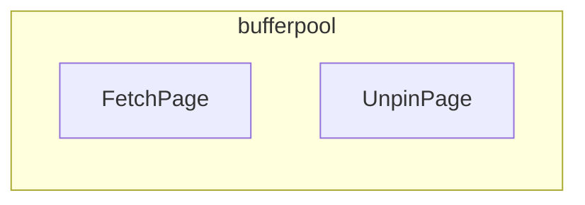

    

         
        
    

         
    

        
	

            
    《CMOS Circuit Design Report》
     
     
    <table style="border:none;text-align:center;width:72%;font-family:仿宋;font-size:14px; margin: 0 auto;">
    <tbody style="font-family:方正公文仿宋;font-size:12pt;">
      <tr style="font-weight:normal;"> 
    		<td style="width:20%;text-align:right;">Course Name </td>
    		<td style="width:2%">：</td> 
    		<td style="width:40%;font-weight:normal;border-bottom: 1px solid;text-align:center;font-family:华文仿宋">CMOS RF IC Design</td>     </tr>
    	<tr style="font-weight:normal;"> 
    		<td style="width:20%;text-align:right;">Project Title</td>
    		<td style="width:2%">：</td> 
    		<td style="width:40%;font-weight:normal;border-bottom: 1px solid;text-align:center;font-family:华文仿宋"> Common-Source Stage LNA with Resistive Feedback</td>     </tr>
    	<tr style="font-weight:normal;"> 
    	    </tr>
    	<tr style="font-weight:normal;"> 
    		<td style="width:20%;text-align:right;">Student Name</td>
    		<td style="width:%"> ：</td> 
    		<td style="width:40%;font-weight:normal;border-bottom: 1px solid;text-align:center;font-family:华文仿宋"> Juyi Lin</td>    </tr>
    	<tr style="font-weight:normal;"> 
    		<td style="width:20%;text-align:right;">Date </td>
    		<td style="width:2%">：</td> 
    		<td style="width:40%;font-weight:normal;border-bottom: 1px solid;text-align:center;font-family:华文仿宋">June 18th</td>     </tr>
       <tr style="font-weight:normal;"> 
    		<td style="width:20%;text-align:right;">Student ID</td>
    		<td style="width:2%">：</td> 
    		<td style="width:40%;font-weight:normal;border-bottom: 1px solid;text-align:center;font-family:华文仿宋">3180103721</td>     </tr>
    </tbody>              
    </table>

<!-- 注释语句：导出PDF时会在这里分页 -->

## 目录

[TOC]

## Introduction

### Purpose

设计一个resistive feedback的LNA. 一般用作各类无线电接收机的高频或中频前置放大器，主要作用是放大天线从空中接收到的微弱信号， 在放大微弱信号的场合，放大器自身的噪声对信号的干扰可能很严重，因此希望减小这种噪声，以提高输出的信噪比。 所以低噪声放大器的设计对整个接收机来说是至关重要的。
###  Circuit  Principal

单电源CS结构采用直流偏置的方案， 叫做 resistive feedback。因为Rf 把漏极的直流电源反馈到栅极， Ig =0， 通过Rf的压降为0V， Vg = Vd， 一定工作在饱和区。上面的偏置M2起到电阻的作用，会根据M1的Ids电流大小来影响Vout。

## Circuit implementation

### process parameter

#### Cox

We get Cox from https://www.edaboard.com/threads/how-we-calculate-cox.56511/

Tox = 4E-9 m （PSpice model of TSMC's 180nm MOSFET process ）
E0=8.85E-18 F/um (Jacop Backer : CMOS circuit design ... , pp114)
Er=3.97 （same book）
Cox=E0*Er/tox
Cox=8.784E-15F/um²

#### un

For a NMOS: u0 = 670 cm^2/(V*s)

#### γ

γ是常数， 短沟道为2/3， 长沟道为1-2. 

我们能调整的是宽长比，输入电压.

#### gm

$$
 \sqrt{(2*un*Cox*Id*W/L)}
$$

#### Rs

50Ω

#### Id

$$
Id = (1/2)*un*Cox*(W/L)*(Vgs-Vth)^2
$$

### Key pereformance parameter

#### Gain

较大的增益有助于减小低噪声放大器后级电路噪声对接收机的影响，但增益过大将会引起线性变的恶化。因此，低噪声放大器的增益应适中，一般在25dB以下。我们取20dB。 15dB - 25dB .

闭环放大器， 反馈电阻和原电阻的比例决定了增益， 电流方向相反
$$
gm1 = 1/50 = 0.02\\
let\ gain = 20dB=>  20 = 20lgAv  => Av = 10\\
that\ is, Rf = Rs*-Av = 500Ω\\
忽略沟道调制效应
=>忽略gmb1=>Rin = \frac{1}{g_{m1}}\\
当负载和源内阻相等时放大效果最好，所以需要调整gm来匹配网络\\
=> gm1 =  \frac{1}{Rs} \\
因为RF分压，可以得到 \\
Vx -g_{m1}VxR_F = Vout \\
=》 \frac{Vout}{Vx} = 1- \frac{R_F}{Rs}
$$

因为是交流，所以增益是电压比的一半。
$$
Av = \frac{1}{2} (1-\frac{R_F}{Rs})\\
Rf >>Rs时， Av = -\frac{R_F}{Rs}
$$

#### Noise Figure

NF  = SNRin/SNRout 信噪比= Av（输入噪声+ 输入信号）+输出噪声

噪声系数与放大器的工作频率、静态工作点及工艺有关，是低噪声放大器最为关键的指标。
Rf的噪声： 4kTRf

噪声系数可以表示为管子宽长比和过驱动电压的二元函数， 可以计算出合适的直流工作点和mos管的宽长比。 
mos管的电阻， 高频忽略flick noise。 
$$
\overline{V^2_{n,out}}|_{RF} = 4kTR_F\\
R_{out} = [\frac{1}{g_{m1}}(1+\frac{R_F}{R_s})] ||(R_F+R_s)\\
=  \frac{(R_F+R_s)}{1+Rs*g_{m1}}\\
由 Rs*g_{m1} = 1 \\
= \frac{1}{2}(R_F+R_s) 
$$

M1和M2的噪声，

$$
\overline{V^2_{n,out}}|_{M1,M2} = 4kT\gamma(g_{m1}+g_{m2}) Rout^2 \\= 4kT\gamma(g_{m1}+g_{m2})\frac{(R_F+R_s)^2}{4}\\
$$

$$
我们已知 NF = 1+  \\
NF = 1 +  \frac{R_F}{R_s(1-\frac{R_F}{R_s})^2}+ \frac{\gamma (g_{m1}+g_{m2})(R_F+R_s)^2 }{R_s(1-\frac{R_F}{R_s})^2} \\
= 1+ 4\frac{R_s}{R_F} + \gamma(g_{m1}+g_{m2})R_s \\ 
gm1Rs = 1 =>\\ 
 NF =1+ 4\frac{R_s}{R_F} +\gamma +  \gamma g_{m2}R_s
$$

#### 静态工作点

找到VEOC 导通边缘， 找到VEOS 饱和边缘， 取中间。 目的：　让输出信号在两个方向都有足够的摆幅。

#### bandwidth

画一个S11 对频率的图，  S11 根据频率变化， -10d B ， 看这两个点的距离就是可以用的带宽。-10db = 20log gain。

## 分组与设计分工

## Results and discussion

### Results

#### noise figure

It is expected that the LNA contributes 2 to 3 dB of noise figure.

#### gain

#### bandwidth

### Discussion

1. 

###   Reference

1. Cox https://www.edaboard.com/threads/how-we-calculate-cox.56511/
2. https://www.edaboard.com/threads/how-to-calculate-uncox.48991/
3. http://ptm.asu.edu/modelcard/2006/90nm_bulk.pm parameter90nm NMOS 
3. http://www.semiinsights.com/s/electronic_components/23/33467.shtml English 
3. 

### 全部代码
