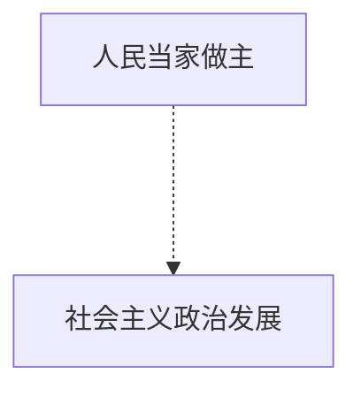

# 习近平新时代新思想

5个材料题, 每个材料题 2-3 个材料, 2-3个问题. 需要归纳分析, 考试时抓紧时间否则时间来不及.

坚持新发展理念,推动经济高质量发展

新时代中国特色社会主义思想，明确坚持和发展中国特色社会主义，总任务是实现社会主义现代化和中华民族伟大复兴，在全面建成小康社会的基础上，分两步走在本世纪中叶建成富强民主文明和谐美丽的社会主义现代化强国；

### 八个明确

明确新时代我国社会主要矛盾是人民日益增长的美好生活需要和不平衡不充分的发展之间的矛盾，必须坚持以人民为中心的发展思想，不断促进人的全面发展、全体人民共同富裕；

明确中国特色社会主义事业总体布局是“五位一体”、战略布局是“四个全面”，强调坚定道路自信、理论自信、制度自信、文化自信；

明确全面深化改革总目标是完善和发展中国特色社会主义制度、推进国家治理体系和治理能力现代化；

明确全面推进依法治国总目标是建设中国特色社会主义法治体系、建设社会主义法治国家；

明确党在新时代的强军目标是建设一支听党指挥、能打胜仗、作风优良的人民军队，把人民军队建设成为世界一流军队；

明确中国特色大国外交要推动构建新型国际关系，推动构建人类命运共同体；

明确中国特色社会主义最本质的特征是中国共产党领导，中国特色社会主义制度的最大优势是中国共产党领导，党是最高政治领导力量，提出新时代党的建设总要求，突出政治建设在党的建设中的重要地位。

领导人叫讲话, dxp退下来,说 谈话, 当然dxp 谈话,别人也不敢不听.

同学们计算机学了, 去华为几十万几百万, 有股份的! 卢老师干了三四十年,我也就一点点钱, 浙大我又没股份, 

第一年47块, 第二年五十几块. 现在一万块也不满足了, 算了,反正一辈子也过去了.

习近平在浙江 指定了, 八八战略.

#### 经济的问题, 套路就回答

五大发展理念:

创新, 协调, 绿色, 开发,共享

全要素生产,

中观层面: 产业体系现代化是建设现代化经济体系的主要目标.

##### 考试选择题

经济体制改革,  完善产权制度和要素市场化配置为重点.(让打工人也有股份)

### 11.28日第四讲  践行社会主义核心价值观，铸就中华文化新辉煌

思考题:

1. 你认为强化意识形态工作在推进改革开放和社会主义现代化建设事业进程中发挥着怎样的作用？为什么？

2. 谈谈如何构建培育和践行社会主义核心价值观的长效机制？

### 12.16日民生

人民是社会发展成果的分享者.

#### 在发展中保障和改善民生  

社会主义初级阶段的基本国情没有变,  最大的发展中国家的国际地位没有变.

要发展中补齐民生短板, 促进社会公平正义

#### 打好脱贫攻坚战

谁来帮扶? 

##### 党政机关\ 国有企事业单位委派干部进行定点帮扶.

**干部驻村帮扶**, 有利于推动农村脱贫公共指标的实现.

应该因地制宜, 发挥优势

滴水穿石, 弱鸟先飞

要综合治理,

 扶持生产,   移民搬迁,  低保政策兜底一批,  医疗救助扶持一批,  教育培训帮扶一批

### 12月23日四个全面

富起来 -强起来的关键时期,进入新时代.

#### 十八大以来一系列伟大变革奠定了新思想的实践基础.

##### 习近平新时代中国特色社会主义思想的体系框架

总目标: 

总任务:

总体布局: 五位一体, 经济政治文化社会和生态文明

战略布局: 四个全面,  全面建设社会主义现代化国家, 全面深化改革, 全面依法治国, 全面从严治党.

主要矛盾转变的依据:  一,改革开放40年, 生产力水平总体上显著提高

但是发展不平衡\不充分.

中国特色社会主义最本质的特征: CCP领导

中国特色社会主义制度的最大优势: CCP领导

##### 全面深化改革总目标:

完善和发展中国特色社会主义制度, 推进国家治理体系和治理能力现代化.

##### 全面依法治国总目标:

建设中国特色社会主义法制体系, 建设社会主义法治国家.

强军目标:  坚持和发展中国特色社会主义的稳定力量.  建设一支听党指挥,能打胜仗, 作风优良的人民军队, 把人民军队建设成为世界一流军队.

#### 十四个坚持

是十八大以来, 我们党坚持和发展中国特色社会主义的基本经验, 是习近平新时代中国特色社会主义思想的重要内容.

十四个坚持也就是十四个方略是习近平新时代中国特色社会主义思想的**实践指南**, 

八个明确是 习近平新时代中国特色社会主义思想的**理论概括**

第一坚持党对一切工作的领导

第二坚持以人民为中心

第三 全面深化改革, 改革是重要法宝.

改革系统性\整体性\协同性

第四 坚持新发展理念.

发展是解决一切问题的基础和关键. 

第五  坚持人民当家作主.

坚持党对一切工作的领导,人民当家作主,依法治国有机统一是社会主义政治发展的必然要求.

第六  坚持全面依法治国

是中国特色社会主义的本质要求和重要保障

第七 坚持社会主义核心价值体系

第八: 在发展中保障和改善民生  

增进民生福祉是发展的根本目的.

第十二:坚持一国两制和推进祖国统一

是中华民族伟大复兴的必然要求

第十三: 坚持推动构建人类命运共同体

#### 习近平新时代中国特色社会主义思想的历史地位.

是对xxx的继承和发展, 马克思主义中国化最新成果,是中国特色社会主义理论体系的重要组成部分.是全党全国人民为实现中华民族伟大复兴而奋斗的行动指南,必须长期坚持并不断发展.

长期坚持的指导思想,  马克思主义中国化最新成果,是21世纪马克思主义,当代中国 马克思主义, 具有特色鲜明的理论品格, 坚持不懈用习近平新时代中国特色社会主义思想武装头脑,指导实践, 推动工作.

### 全面从严治党12.30

把全面从严治党纳入战略布局.

统筹推进五位一体, 四个全面.

#### 一.重视党的建设是马克思主义政党的一般规律.

马克思恩格斯, 奠定了无产阶级政党的理论基础. 

党的十九大重新确立了党的建设总要求

•**目的：**坚持和加强党的全面领导

•**指导方针：**坚持党要管党、全面从严治党

•**主线：**加强党的长期执政能力建设、先进性和纯洁性建设

•**总体布局：**强调党的政治建设的首要地位和统领作用，把党的纪律建设纳入其中，将党的制度建设贯穿党的建设全过程，提出深入推进反腐败斗争，更加在注重党的建设的整体性和系统性。

•**目标：**把党建设得更加坚强有力，不断提高党的建设质量，把党建设成为始终走在时代前列、人民衷心拥护、勇于自我革命、经得起各种风浪考验、朝气蓬勃的马克思主义执政党。

以健全和完善党建总体布局为全面加强党的建设的总抓手

巩固八个基础:   经济基础,政治基础,.. 文化..

执政能力建设、先进性和纯洁性建设是党的建设的永恒课题

#### 把党的政治建设摆在首要地位.

党的政治建设是党的根本性建设.是最重要的, 是统领、是核心；党的其他建设最终的着眼点和落脚点必须在政治建设上。

党 四个意识 : 政治意识, 大局意识, 核心意识, 看齐意识.

•坚定“四个自信”

•  做到“两个维护”

•  全党要严守党的政治纪律和政治规矩

  严肃党内政治生活是党的政治建设的重要任务，也是政治建设的基本途径。

坚持党中央权威和集中统一领导是党的政治建设的首要任务

#### 思想建设是党的基础性建设

#### 把纪律建设摆在更突出的位置

政治纪律, 组织纪律, 工作纪律, 生活纪律, 群众纪律. 

#### 标本兼治抓党的作风建设

密切联系群众, 反对腐败.

•党的作风关乎人心向背和事业兴衰。

•作风问题本质上是党性问题。

•我们党的最大政治优势是密切联系群众，执政后的最大危险是脱离群众。

#### 实现党的制度建设常态化、创新化

•加强制度建设是管党治党的关键，也是全面从严治党的根本。**党章、准则、条例等**。

•优化和完善中央巡视制度。2015年中央印发《中国共产党巡视工作条例》

•创新和推进网上举报机制

健全党内监督体系。《中国共产党廉洁自律准则》、《中国共产党党内监督条例》

### 生态文明建设1.6

十九大报告

提出"富强民主文明和谐美丽"的社会主义现代化强国目标.

生态文明建设是关系中华民族永续发展的根本大计. 

#### 树立生态文明理念

尊重自然, 顺应自然,保护自然.

优质生态产品供给不足, 生态环境遗留问题解决难度加大.

财政收入超过19万亿元

有条件有能力解决生态环境突出问题的窗口期.

以良好生态环境是最普惠的民生福祉为宗旨精神(价值观)

环境问题是民生问题

#### 两山理念,建设美丽中国

